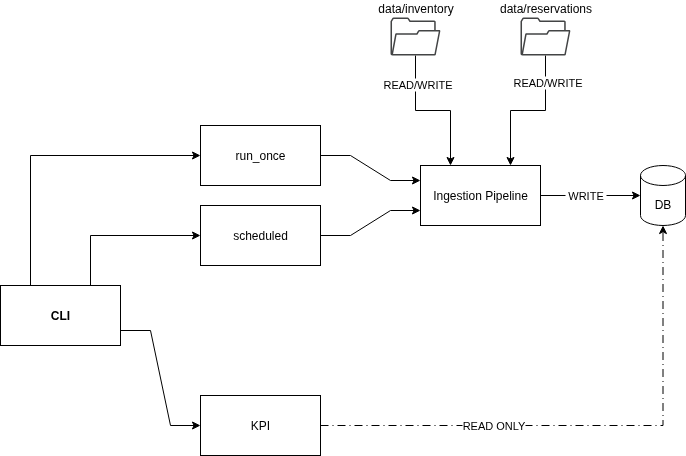
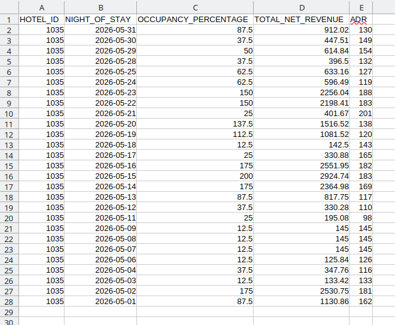
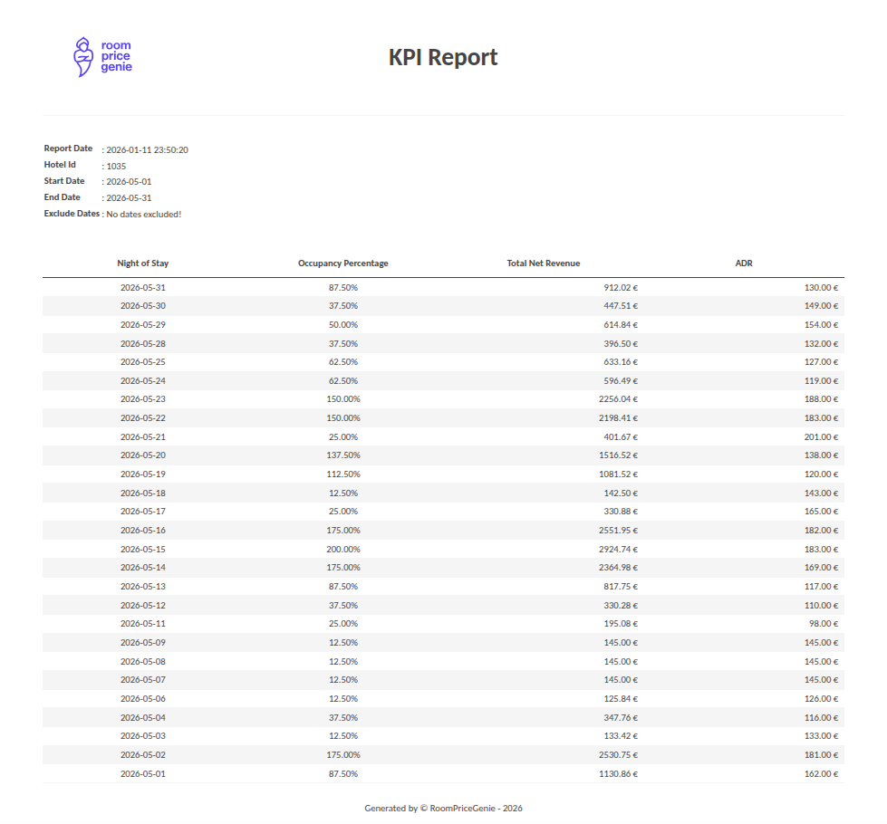

## Room Price Genie - _RPG Pipeline_

**RPG Pipeline** is a small data ingestion and KPI generation pipeline that ingests inventory and/or reservations 
from Odyssey PMS and generates KPIs from ingested data using `hotel_id`, `from_date` and `to_date`

It is designed as a CLI based project:
- It is using configuration JSON file to define all necessary configuration parameters.
- The pipeline ingests and validates inventory and/or reservations data and store them into DuckDB database
- The pipeline can be executed by `run_once`, or `scheduled`
- CLI can be used to calculate and export KPIs of the hotels using `hotel_id`, `from_date` and `to_date` 
as **CSV** and **HTML**

## Installation

### Install usig `install.sh`

The projects includes a simple installation script that creates a virtual environment and installs the project.

1) Make the script executable 
```bash
chmod +x install.sh
```

2) Run the installer 
```
./install.sh
```

### What`install.sh` does
```
python -m venv .venv
source .venv/bin/activate
pip install -U pip
pip install -e .
rpg --help
```
Once the installation finished successfully, you should see the output shown below
```
positional arguments:
  {run-once,schedule,kpi}
    run-once            Run pipeline once and exit
    schedule            Run pipeline in scheduled mode
    kpi                 Calculate KPI based on hotel_id and date range

options:
  -h, --help            show this help message and exit
  --config-path CONFIG_PATH
                        Pipeline configuration JSON file
```

## Configuration 

To use the pipeline, you should prepare the configuration JSON file to define all necessary configuration parameters

You can see the sample output of `config.json` file below:
```json
{
  "source_type": "local",
  "source_config": {
    "inventory_path": "/home/otekir/workspace/data/inventory",
    "inventory_column_separator": ",",
    "reservations_path": "/home/otekir/workspace/data/reservations"
  },
  "db_config": {
    "engine_module": "rpg.db_engine.duckdb_engine",
    "engine_name": "DuckDBEngine",
    "db_path": "db/rpg.db"
  },
  "archive_path": "/home/otekir/workspace/data/archive"
}
```

### Configuration Parameters 

- `source_type` (_required_) : Pipeline can ingest Odyssey PMS data from both `local` and `API` 
> ⚠️ **Warning**
> 
> This version of pipeline just allows to use `local` as `source_type`

- `source_config` (_required_) : Configuration parameters specified for `source_type`
  - `inventory_path` (_required_) : Path to the directory that stores inventory CSV file
  - `inventory_column_separator` (_required_) : Column separator for the inventory CSV file
  - `inventory_path` (_required_) : Path to the directory that stores reservations JSON file(s)
- `db_config` (_required_) : Database configuration parameters.
  - `db_path` (_required_) : Database file path.
  - `engine_module` (_required_) : Database engine module name. Multiple modules can be used and pipeline dynamically 
  - `engine_name` (_required_) : Class name of the database engine module.
  initialize module defined in the configuration parameters. 
> ⚠️ **Warning**
> 
> This version of pipeline just allows:
> 
> **engine_module** : `rpg.db_engine.duckdb_engine`
> 
> **engine_name** : `DuckDBEngine`
- `archive_path` (_required_) : Path to the archive folder that will store processed files.


## CLI Usage

After installation, the CLI entrypoint is available as:
```
rpg --help
```
### Global arguments (_required_)
All commands require a configuration file to initialize pipeline 
- `--config-path` (_required_) : Path to the configuration JSON file

**Usage Example:**
```
rpg --config-path config/config.json <command> [options]
```

### Commands

#### 1) `run-once`
Runs the pipeline once and exit.

```
rpg --config--path config/config.json run-once
```
What it does: 
- Runs the ingestion pipeline **once** and exits.

#### 2) `schedule`
Runs the pipeline in scheduled mode.

Required option:
- `--interval-minutes` (_required_, int) : Schedule interval in minutes 
```
rpg --config-path config/config.json schedule --interval-minutes 10
```
What it does: 
- Initialize and set the pipeline to run every 10 minutes.

#### 3) `kpi`
Calculate KPI report for a given `hotel_id`, `from_date` and `to_date`, and exports the KPI results as `CSV` or `HTML`

Required options:
- `--from-date` (_required_) : Start date in `YYYY-MM-DD` format.
- `--to-date` (_required_) : Start date in `YYYY-MM-DD` format.
- `--hotel-id` (_required_, int) : Integer ID of the hotel.

Optional options:
- `--exclude-dates` (_optional_) : Comma-separated date list in `YYYY-MM-DD` format (**no spaces**).
  - Example `2026-01-01,2026-01-05`
- `--export-type` (_optional_) : Export type of the KPI report. Allowed values: `CSV`, `HTML`. Default: `CSV`
- `--export-path` (_optonal_) : Output directory path. Default: current working directory

**CSV export (default)**
```
rpg --config-path config/config.json \
    --from-date 2026-01-01 \
    --to-date 2026-01-31 \
    --hotel-id 1035
```

**HTML export**
```
rpg --config-path config/config.json \
    --from-date 2026-01-01 \
    --to-date 2026-01-31 \
    --hotel-id 1035 \
    --export-type HTML
```

**Exclude specific dates**
```
rpg --config-path config/config.json \
    --from-date 2026-01-01 \
    --to-date 2026-01-31 \
    --hotel-id 1035 \
    --exclude-dates 2026-01-10,2026-01-11
```

**Export to custom directory**
```
rpg --config-path config/config.json \
    --from-date 2026-01-01 \
    --to-date 2026-01-31 \
    --hotel-id 1035 \
    --export-path /home/otekir/reports
```

### Date validation rules
- Dates must be in `YYYY-MM-DD` format
- `--exclude-dates` muts be a **comma-separeted** list of dates in `YYYY-MM-DD` format.
- `--export-type` accepts only `CSV` or `HTML` (**case-insensitive**)

### Architecture and Design



- `CLI`: CLI is responsible for instantiate and run the pipeline in `run_once` and `scheduled` mode, and 
calculate/export KPI reports.
- `Ingestion Pipeline`: Ingestion pipeline is responsible for reading `inventory` and `reservations` files, 
run validation rules and load them into database. The ingestion pipeline can be executed in `run_once` and `scheduled`
mode. `INGESTION` and `LOGIC` validation performs in ingestion pipeline.
- `Scheduler`: Scheduler is responsible for running the ingestion pipeline in pre-defined periods.
- `Database`: Database is responsible for storing `inventory`, `reservations` and `rejected reservations`. 
- `Database Views`: Database view are responsible for performing `BUSINESS` level validations and `KPI` calculations.
All the deduplication, business level validations and KPI calculation are performing by using:
  - `view_reservations`: Business level validation and deduplication.
  - `view_kpi`: KPI calculation.
- `KPI`: KPI is responsible for calculating KPI report and exporting calculated report as `CSV` or `HTML`.


### Data Validation Rules
You can find the detailed data validation rules documentation here:
[Data Validation Rules](src/docs/DATA_VALIDATION_RULES.md)

### Pipeline Ingestion Logic
You can find the pipeline ingestion logic documentation here:
[Pipeline Ingestion Logic](src/docs/INGESTION_LOGIC.MD)

### Sample KPI Report 
You can find the sample KPI report for the `hotel_id`=`1035` for the dates between `2026-05-01` and `2026-05-31`:
- `CSV`: [CSV sample](src/docs/export_samples/kpi_1035_2026_05_01_to_2026_05_31.csv)
- `HTML`: [HTML sample](src/docs/export_samples/kpi_1035_2026_05_01_to_2026_05_31.html)

### Output file name convention
Output file name is automatically formatted as: 

`kpi_<hotel_id>_<YYYY>_<MM>_<DD>_to_<YYYY>_<MM>_<DD>.<file_extension>`

Example:
- CSV : `kpi_1036_2025_01_01_to_2026_02_01.csv`


- HTML : `kpi_1035_2026_01_01_to_2026_02_01.html`

