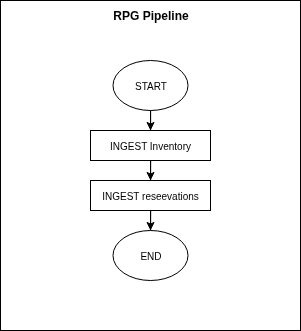
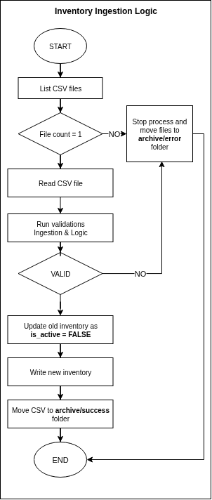
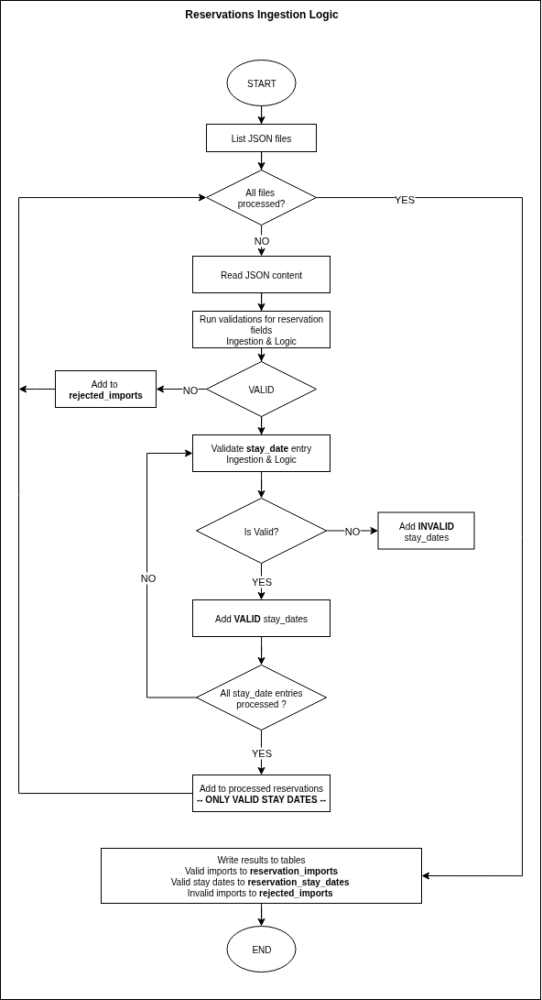

# Ingestion Logic

The pipeline ingests the `inventory` and `reservations` from the folders:

The pipeline consists of two ingestion logic:
- **Ingest inventory** : To keep the system up-to-date, the pipeline supports ingesting new inventory files and update 
inventory table. The pipeline can process **ONLY** one CSV file at a time to prevent inconsistent data.
- **Ingest reservations** : The pipeline can process multiple reservations JSON files during the execution. 

### Ingestion Logics

## Pipeline Logic

## Inventory Ingestion Logic

## Reservations Ingestion Logic
